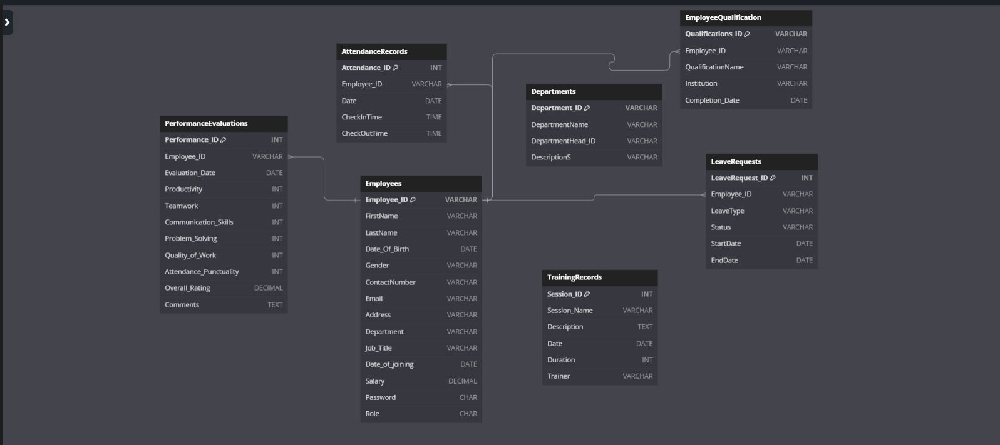

# Employee Management System (EMS)

## Overview
The Employee Management System (EMS) is a web application designed to manage employee records, track attendance, monitor performance, handle leave requests, and maintain training records. The backend is built using MySQL and Python, while the frontend is developed with Streamlit.

## Features
- **Employee Management:** Add, view, and manage employee details such as personal information, job title, department, and salary.
- **Department Management:** Manage departments and assign department heads.
- **Qualification Tracking:** Record and manage employee qualifications.
- **Training Records:** Maintain a log of training sessions including session details, date, and trainer.
- **Performance Evaluations:** Evaluate employee performance based on various criteria such as productivity, teamwork, communication skills, and more.
- **Attendance Tracking:** Track employee attendance with check-in and check-out times.
- **Leave Management:** Handle employee leave requests with status tracking.

## Technologies Used
- **Backend:** MySQL, SQL, Python
- **Frontend:** Streamlit

## Database Schema

